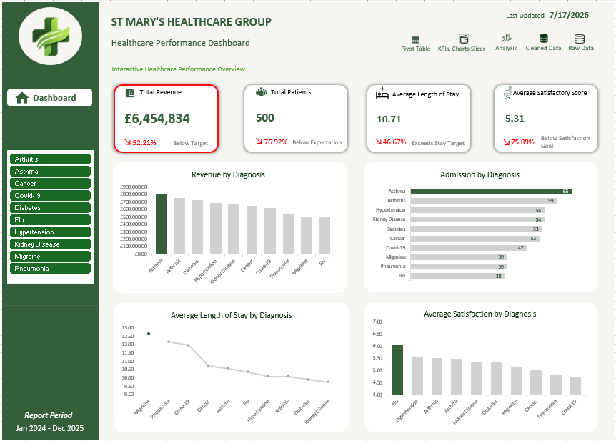

# Healthcare Performance Dashboard | Excel Data Analytics Capstone

> An end-to-end Excel data analytics project focused on evaluating the operational and financial performance of **St. Mary's Healthcare Group** through data cleaning, exploratory analysis, dashboard development, and business reporting.

---

## Project Overview

This project was completed as part of my Data Analytics learning journey to simulate a real-world business analysis scenario.

Using healthcare operational data from **January 2024 to December 2025**, I cleaned and transformed the dataset, developed key performance indicators (KPIs), built an interactive dashboard, and carried out exploratory analysis to identify trends, evaluate performance, and provide business recommendations.

Rather than stopping after building the dashboard, I explored additional business questions to better understand the factors influencing hospital performance, including city performance, payment methods, physician performance, patient age groups, severity levels, and length of stay.

---

## Problem Statement

St. Mary's Healthcare Group needed to evaluate its operational and financial performance using historical patient data collected between **January 2024 and December 2025**.

Management required visibility into key performance indicators such as revenue, patient admissions, length of stay, and patient satisfaction to determine whether organizational targets were being achieved.

The objective of this project was not only to build an interactive Excel dashboard but also to investigate the factors influencing hospital performance, uncover meaningful findings, and provide practical recommendations that could support better operational and strategic decision-making.

---

# Dashboard Preview



---

## Tools Used

### Software

- Microsoft Excel
- Power Query
- Pivot Tables
- Pivot Charts
- Slicers
- Conditional Formatting
- XLOOKUP

### Analytical Skills

- Data Cleaning
- Data Transformation
- Feature Engineering
- KPI Development
- Exploratory Data Analysis (EDA)
- Dashboard Design
- Data Visualization
- Business Reporting
- Analytical Storytelling

---

# Methodology

The project followed a structured data analysis workflow.

### 1. Understanding the Dataset

- Reviewed the dataset structure
- Identified patient information and business-related fields
- Defined the business questions to answer

### 2. Data Cleaning & Preparation

Using Power Query, I:

- Removed duplicate records
- Handled missing values
- Corrected inconsistent text entries
- Standardized formats
- Assigned appropriate data types
- Prepared the dataset for analysis

### 3. Feature Engineering

Created additional calculated columns including:

- Total Cost
- Length of Stay
- Cost Per Day
- Admission Month
- Admission Year
- Admission Month & Year
- Day of the Week
- Age Group
- Length of Stay Category

### 4. Exploratory Data Analysis

Used Pivot Tables to:

- Build KPIs
- Compare diagnosis performance
- Analyze city performance
- Evaluate doctor performance
- Compare payment methods
- Analyze severity levels
- Explore patient length of stay

### 5. Dashboard Development

Developed an interactive dashboard containing:

- KPI Cards
- Pivot Charts
- Diagnosis Slicer
- Navigation Buttons
- Performance Metrics

The dashboard layout was inspired by a healthcare dashboard on Dribbble and redesigned to match the objectives and KPIs of this project.

### 6. Reporting

Prepared a business report summarizing:

- Findings
- Insights
- Recommendations
- Management presentation

---

# Key Findings

### Dashboard Findings

- Total Revenue reached **£6,454,834**, achieving **92.21%** of the planned target.
- Total Patient Admissions reached **500**, representing **76.92%** of the planned target.
- Average Length of Stay was **10.71 days**, exceeding the target of **5 days**.
- Average Patient Satisfaction scored **5.31 / 10**, below the target score of **7**.
- Asthma recorded the highest admissions (**65**) and generated the highest revenue (**£805,568**).

---

### Exploratory Analysis

Further investigation revealed that:

- Long Stay patients generated the highest revenue due to having the highest patient volume.
- Sheffield generated the highest revenue per patient despite London producing the highest overall revenue.
- Elder patients recorded the same number of Critical cases as Adults despite a much smaller population.
- Private payment patients had the longest hospital stays and the lowest satisfaction scores.
- Dr. Taylor achieved the highest patient satisfaction while maintaining one of the shortest average lengths of stay.
- Medium and High severity patients generated more revenue than Critical patients because of higher patient volume.

---

# Recommendations

Based on the analysis, I recommended the following actions:

- Increase patient admissions through stronger referral partnerships and community outreach.
- Review discharge planning and treatment workflows to reduce unnecessary patient stays.
- Improve patient experience by acting on patient feedback.
- Study high-performing cities to identify practices that can be replicated elsewhere.
- Strengthen preventive care for older patients.
- Review payment workflows and encourage knowledge sharing among physicians to improve patient outcomes.

---

# Repository Structure

```
Healthcare-Capstone/
│
├── data/
│   ├── Raw Dataset.xlsx
│   └── Cleaned Dataset.xlsx
│
├── dashboard/
│   └── Healthcare Dashboard.xlsx
│
├── report/
│   └── St Mary's Healthcare Report.pdf
│
├── presentation/
│   └── Capstone Presentation.pptx
│
├── images/
│   ├── dashboard-preview.png
│   ├── pivot-table-analysis.png
│   ├── power-query-cleaning.png
│   └── presentation-preview.png
│
└── README.md
```

---

# 📁 Files Included

| Folder | Description |
|----------|-------------|
| **data** | Raw and cleaned datasets used during the project |
| **dashboard** | Interactive Excel dashboard |
| **report** | Business analysis report |
| **presentation** | Capstone presentation slides |
| **images** | Dashboard and project screenshots |

---

# Lessons Learned

Working on this project changed the way I approach data analysis.

Instead of treating dashboards as the final deliverable, I learned that they are only one part of the analytical process. The real value comes from asking meaningful business questions, investigating the factors behind the numbers, and communicating findings in a way that supports better decision-making.

This project also strengthened my skills in data cleaning, exploratory analysis, dashboard design, business reporting, and presenting analytical findings to different audiences.

---

# Author

**Chukwuemeka Onyekaodiri**

Data Analyst | Excel • SQL • Power BI • Python

🌐 Portfolio Website  
https://www.chukwuemekaonyekaodiri.com

💼 GitHub  
https://github.com/CDatacentric
